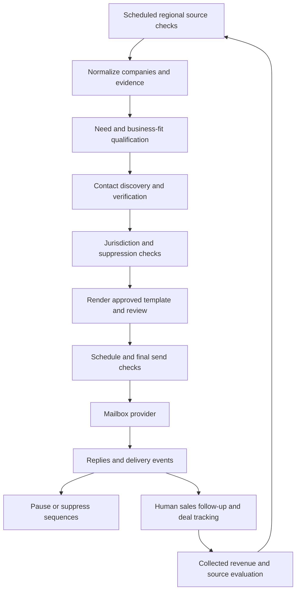

# Argmax worldwide client acquisition system

Prepared 14 September 2026. Status: implementation plan, not a deployed system.

## 1. Recommended direction

Build a small cloud service that discovers business events worldwide, identifies a plausible software project, checks whether the company and contact qualify, renders your approved email template, sends a short sequence, and tracks the relationship through a paid engagement.

The objective is profitable, manageable client relationships. Track qualified conversations, signed work, collected payments, and repeat business. Email volume is a capacity constraint, not the success metric. No system can guarantee clients: the plan makes the acquisition process measurable and improves it from actual results.

Use two main acquisition tracks: recently funded small companies and established businesses with recurring operational needs. Add a smaller partnership track for agencies and consultants that can refer repeat work. Funding is a useful timing signal, but does not establish buying intent, accessible budget, or payment reliability.

Your PC runs the dashboard and development tools. Discovery, AI calls, scheduling, sending, and reply monitoring run in the cloud even when your PC is off.

This document specifies the future system. No prospects have been enrolled, accounts purchased, DNS records changed, or emails sent.

## 2. Known facts and provisional assumptions

Argmax advertises AI systems, product engineering, backend engineering, automation, infrastructure, and modernization. Its work page includes knowledge search, automotive intelligence, packaging OCR, hospitality analysis, and notification infrastructure. These support specific offers rather than a generic software-development pitch. These are Argmax's own descriptions, not independently verified performance results. [Services](https://argmax.one/services), [work](https://argmax.one/work).

The current workspace contains no application code or email template. Questions about budget, preferred project size, delivery capacity, mailbox setup, template, and approval preferences are pending.

Planning defaults, to replace when you answer:

| Item | Initial assumption |
|---|---|
| Operating budget | US$100–250/month, excluding development, sales labor, and tax |
| Delivery capacity | One or two new projects per month |
| Main project range | US$3,000–20,000; a hypothesis, not a price commitment |
| Entry engagement | A small paid discovery or implementation milestone |
| Sending | One real business mailbox initially; a second only when justified |
| Language | English first; other languages after template and reply support are ready |
| Approval | Review the first campaigns, then automate qualified records within approved rules |
| Discovery geography | Worldwide from the outset |
| Sending geography | Enabled country by country after the contact rules are configured |

These assumptions allow planning to proceed; they do not authorize spending or publishing campaigns.

## 3. Who to target

Start with these three groups. Employee counts are approximate filters and should never override direct evidence of a good project.

| Group | Initial profile | Strong reason to contact | Buyer | Allocation of qualified-account research |
|---|---|---|---|---:|
| Established operating businesses | Roughly 10–150 employees, identifiable customers and an active business | Expansion, repeated data entry, document processing, disconnected tools, reporting demand | Owner, COO, operations head | 50% |
| Funded startups | Roughly 5–80 employees, seed/Series A or comparable stage, funding announced within 90 days | A funded initiative plus integration, delivery, AI, or backend needs | Founder, CTO, product/engineering head | 35% |
| Delivery/referral partners | Roughly 3–50 employees, design agencies, specialist consultants, implementation firms | Clients needing engineering beyond the partner's capacity | Founder, delivery director | 15% |

For funding, initially explore announced rounds around US$0.5–15 million. This is a discovery range, not a claim about cash available or a universal budget cutoff. Keep amount, currency, round type, announcement date, and actual event date separate. Debt, grants, extensions, and total lifetime funding must not be mislabeled as a new equity round.

Prefer repeatable business problems with an owner and measurable cost. Avoid making early campaigns depend on enterprise procurement, expensive certifications Argmax does not hold, or highly sensitive production access. Companies above roughly 250 employees go to manual review. Pre-revenue idea-only requests, unclear ownership, unpaid speculative builds, and incompatible delivery demands rank poorly.

Do not infer reliability from nationality, names, or country income. Compare actual company evidence, communication, scope, and commercial terms.

## 4. Turn the portfolio into offers

Choose two offers for the first pilot. The other offers remain available when a prospect clearly fits.

| Offer | Business trigger | Concrete entry scope | Relevant Argmax evidence |
|---|---|---|---|
| Workflow and integration improvement | New locations, growing order volume, recurring manual reporting | Map one workflow and automate one costly handoff | Automation services and backend work |
| Document/OCR pipeline | Packaging, catalog, invoice, or inventory data needs | Test representative documents and connect one output workflow | Visionary Extractor |
| Private company knowledge search | Scattered internal documentation or repeated information requests | Connect a small approved dataset with access rules and an evaluation set | Bodh / Anvaya |
| Backend reliability improvement | Integration launches, operational incidents, scaling initiative | Diagnose one bottleneck and implement a bounded improvement | Sandesh / Vega |
| Automotive market intelligence | Multi-location inventory and pricing operations | A limited inventory comparison and reporting workflow | Drishti |

A first offer should explain the business outcome, what the initial engagement includes, and how the buyer can assess it. Avoid promising a complete platform or quoting a delivery date before scoping.

Before outreach, create a proof library: approved project descriptions, live URLs, exact capabilities demonstrated, publishable screenshots, and any measured results you can substantiate. The model can only use approved entries. Confidential working titles must not be represented as identifiable customer endorsements.

One trust issue to review on the website: the homepage testimonial section describes client quotes, while the visible cards are labeled “Core design principle.” Clarify those labels before directing significant traffic there. This is a recommendation, not a website change made during planning. [Argmax homepage](https://argmax.one/).

## 5. Worldwide discovery without an expensive crawler

Maintain a source registry. Each source needs region, languages, owner, access method, permitted use, rate limit, update interval, cost, parser version, and last successful fetch. A search hit is a discovery pointer; verify the actual announcement or company page before using it in an email.

Initial source hierarchy:

1. Company newsrooms, investor portfolio announcements, accelerator announcements, and relevant public job pages.
2. Permitted industry association directories, exhibitor lists, local business directories, and public procurement opportunities matched to Argmax's size.
3. Search/news APIs and licensed company/contact data for gaps.
4. Manual research where an important source has no suitable API or permitted automated access.

YC's company directory and Techstars' portfolio are useful seed lists. Being listed does not establish a recent funding event. Crunchbase offers funding and firmographic API products, but access and licensing need a specific entitlement; do not assume a website subscription includes the required API. [YC directory](https://www.ycombinator.com/blog/the-yc-directory/), [Techstars portfolio](https://www.techstars.com/portfolio), [Crunchbase data products](https://data.crunchbase.com/docs/welcome-to-crunchbase-data).

Worldwide means deliberate regional coverage, not just English search results:

| Research lane | Candidate source categories | Language coverage to add |
|---|---|---|
| US / Canada | Local investors, industry groups, business expansion announcements | English, French |
| Europe / UK | National startup ecosystems, sector associations, regional investors | English, French, German, Spanish and relevant local languages |
| Latin America / Caribbean | Local accelerators, investment announcements, distributors and operators | Spanish, Portuguese, English |
| Middle East / North Africa | Accelerator portfolios, operating-business expansions, investor news | Arabic, English, French |
| Sub-Saharan Africa | Local investors, logistics and business-service associations | English, French, Portuguese and relevant local languages |
| South Asia | Regional startup ecosystems, exporters, manufacturers, service businesses | English plus selected local languages |
| East / Southeast Asia | Local investor announcements, industry associations, business directories | English, Japanese, Korean, Chinese, Bahasa Indonesia, Vietnamese as relevant |
| Australia / New Zealand / Pacific | Local investors, regional business networks, operating companies | English and relevant local languages |

These are research lanes, not promises that every source is automatable or every country permits unsolicited email. Launch with a few vetted sources per lane and expand according to yield. Complete regional source selection during implementation; no global coverage percentage has been established in this planning pass.

Use native-language discovery queries even before native-language campaigns are ready. Store the original evidence and an internal translation. Choose outreach language from the business's actual communications, not from a person's name.

Example query families, rotated by region and language:

```text
[industry] [country] "raised" "seed" [recent date window]
[investor] "new investment" [industry]
[industry] "opens" "warehouse" [country]
[company] careers "integration"
[company] "customer portal" OR "partner API"
[industry] "software development partner" [country]
```

Poll timely announcements every 6–12 hours, refresh job/expansion sources daily or weekly as appropriate, and run slower directory discovery weekly. Use RSS/API access where available, conditional requests, content hashes, and published rate limits. Store small permitted evidence excerpts and URLs; full-page retention depends on source rights.

Give each active region a small research floor, then allocate the remaining research budget by qualified leads and conversations per dollar. Reserve around 20% for exploration so early English-language results do not consume the whole budget.

## 6. Identify software need, not just funding

Every shortlisted company gets a concise evidence card:

```text
Company and canonical domain
Company identity and size evidence
Observed business event, event date, source URL, retrieved date
Second relevant signal, if available
Potential operational problem, explicitly labeled as a hypothesis
One proposed bounded project
Why Argmax can help, with approved proof ID
Likely buyer and current-role evidence
Evidence gaps and reasons to reject
```

Useful combinations:

- New warehouse + operations hiring + document-heavy product catalog → investigate an inventory/document workflow.
- New funding + announced integration roadmap → investigate a bounded connector or backend project.
- Multiple operating locations + fragmented reporting products → investigate reporting consolidation.
- Public request for a development partner + a defined business initiative → high-priority direct demand.
- Expanding agency + published services that omit engineering → possible delivery partnership.

A job ad is not proof of outsourcing intent. A weak website is not proof of internal software pain. A technology detector is not proof of a company's full stack. Funding alone is insufficient for automatic outreach.

For recent funding, use the last 30 days as the highest freshness band, 31–90 days as active, and 91–180 days only when another current signal exists. Deduplicate syndicated announcements; ten copies of one press release are one signal. Keep publication time separate from the funding event. Hold conflicting amounts or dates instead of having AI choose a convenient answer.

## 7. Qualification and reliability

Use a rules-based score with visible components. AI extracts evidence and drafts hypotheses; it does not invent a numerical probability that someone will buy.

| Component | Points | Evidence sought |
|---|---:|---|
| Observable need or buying initiative | 25 | Direct request, named project, operational event tied to software |
| Match to Argmax and a bounded offer | 20 | Relevant approved proof and a deliverable within capacity |
| Operating stability / budget evidence | 20 | Active business, customers, established operations, corroborated funding |
| Timing | 15 | Recent event and a plausible reason to act now |
| Decision-maker access | 10 | Current, relevant role and suitable business contact |
| Delivery practicality | 10 | Language, time overlap, scope, procurement and support fit |

Initial rules: 75+ can qualify; 55–74 requires review or more evidence; below 55 stays out of the sending queue. These thresholds are starting hypotheses to calibrate against manually reviewed examples. Scores do not establish creditworthiness.

Automatic qualification also needs at least 15/25 for need, a corroborated trigger, valid contact verification, and a passing contact-policy decision. A high total cannot override a failed gate. Unknown identity, conflicting evidence, unknown applicable jurisdiction, or unsupported claims must lead to review/hold.

Reliability has two stages. Before contact, assess public company identity, active operations, realistic scope, and the quality of evidence. During sales, confirm the budget owner, payment process, decision timeline, project owner, and acceptance criteria. Use a paid first milestone and clear payment terms; expand the relationship after delivery and payment. The discovery system cannot establish whether a company will pay on time.

Suppress current clients, active opportunities, opted-out contacts, and accounts already approached through another campaign or partner. Use account-level ownership so two tracks do not approach the same business concurrently.

## 8. Contact discovery

Identify the buyer before buying contact data. For smaller firms, that may be the founder; for operational projects, prefer the owner or operations lead; for technical initiatives, prefer the CTO or engineering/product owner.

Process:

1. Check the company's own relevant business-contact pages and current role information.
2. Use one licensed finder for missing business addresses; Hunter is the initial candidate.
3. Record address source, discovery date, role evidence, vendor status, and applicable contact basis.
4. Verify addresses before enrollment; reverify if verification is more than 14 days old at the first send.
5. Automatically exclude invalid, disposable, and unknown results; hold catch-all addresses for review.

Hunter exposes domain search, email finding, verification, and source information. Its pricing distinguishes finder and verification credits, and some finder flows already include verification. Avoid paying twice for the same result. Confirm the actual plan entitlement before integration. [Hunter API](https://hunter.io/api-documentation/v2), [credit explanations](https://help.hunter.io/en/articles/15921145-faqs-about-finding-emails-in-hunter).

Verification estimates deliverability; it does not prove consent, role accuracy, or inbox placement. Initially contact one person per account. A referred colleague can be considered after checking their eligibility. Do not manufacture address permutations and send test marketing emails to see which bounce.

## 9. Country-aware contact policy

This is a conservative operational design, not a complete legal opinion for every jurisdiction. Maintain a reviewed rule table with source links, effective dates, review dates, sender location, recipient location, entity/contact type, and channel. Country codes on domains are not sufficient location evidence. If multiple rules apply, satisfy all applicable conditions; unresolved cases remain on hold.

| Market | Initial sending treatment |
|---|---|
| US | Relevant commercial email only after the identity, truthful subject, advertising disclosure, postal address, and opt-out checks pass |
| UK | Distinguish corporate subscribers from sole traders and individual subscribers; apply personal-data obligations where applicable |
| France | Role-relevant B2B outreach needs the relevant information and objection requirements; encode France-specific conditions |
| Other EU/EEA countries | Review national electronic-marketing rules individually; a GDPR legitimate-interest assessment does not by itself authorize email |
| Canada | Require documented express consent or a demonstrable applicable implied-consent/exemption basis |
| Australia | Require express or properly supported inferred consent and the other applicable conditions |
| Other / uncertain countries | Research permitted business information; hold automated cold email until the relevant rules are reviewed |

The US CAN-SPAM rules also cover B2B email. Apply the footer and opt-out requirements to the initial message and follow-ups. [FTC business guide](https://www.ftc.gov/business-guidance/resources/can-spam-act-compliance-guide-business).

UK guidance distinguishes corporate and individual subscribers and notes that UK GDPR can still apply to business contacts. The ICO flags its guidance as under review following legislative changes; recheck before launch. [ICO B2B marketing guidance](https://ico.org.uk/for-organisations/direct-marketing-and-privacy-and-electronic-communications/business-to-business-marketing/).

France's regulator describes professional relevance, information, and the right to object. Do not generalize this into one EU-wide cold-email rule. [CNIL electronic prospecting guidance](https://www.cnil.fr/fr/la-prospection-commerciale-par-courrier-electronique).

Canada's public-address implied-consent basis is conditional; an address being visible online is not sufficient by itself. Preserve the evidence supporting each condition. [CRTC implied-consent guidance](https://crtc.gc.ca/eng/com500/guide.htm).

Australian guidance requires consent and says an electronic message asking for consent can itself be marketing. A “permission request” email is not a universal workaround. [ACMA spam guidance](https://www.acma.gov.au/avoid-sending-spam).

Where cold email is unavailable, develop inbound pages, appropriate marketplace proposals, public responses to explicit supplier requests, and permission-based introductions under the relevant channel rules. Automated social DMs and contact-form submissions are not default substitutes.

Maintain a global suppression list, including across imports and campaigns. Honor objections immediately in the system. Provide a real identity, working reply address, appropriate privacy notice, postal address where required, and an easy opt-out. Collect only needed business information; support access, correction, deletion, and objections. Set retention periods by purpose, local obligations, and data-provider terms. A proposed default is to purge unused research after 90 days and review inactive leads after 180 days, retaining only the minimal suppression record needed to prevent recontact.

Review sender-side obligations, processor agreements, access controls, and international data transfers too; recipient-country classification alone is not a complete compliance check.

## 10. Personalize your existing template safely

Import your exact subject and body as a versioned template. Preserve fixed wording. You decide which portions are variable and whether different offers have separate approved versions.

Suggested fields:

```text
{{first_name}}
{{company}}
{{verified_observation}}
{{relevant_problem_hypothesis}}
{{bounded_offer}}
{{approved_proof_sentence}}
{{call_to_action}}
{{sender_signature}}
{{required_footer}}
```

The model produces structured values for the approved fields with supporting evidence IDs. Code inserts them into the template. Empty fields, unknown placeholders, missing evidence, unsupported numbers, invented familiarity, and unapproved promises block the message.

Example of the logic, using a fictional company:

```text
Observed: A distributor announced a second warehouse.
Hypothesis: Inventory handoffs may become more complicated.
Offer: Explore one inventory/reporting integration.
Proof: Approved description of a relevant Argmax project.
```

An appropriate sentence is: “I saw your announcement about the second warehouse. If inventory reporting is becoming harder across locations, we could help connect that workflow.” It should not claim the company uses spreadsheets unless the evidence actually says so.

Aim for one relevant observation, one plausible outcome, one short proof point, and one easy question. Keep the first message around 80–140 words where your template permits. Preserve a longer template if you prefer; test brevity as a deliberate variant. Use links selectively and omit attachments in the initial pilot. Never fabricate client results, endorsements, personal research, or a prior relationship.

For local-language campaigns, review the translated fixed template and maintain enough language capability to handle replies. Do not translate thousands of emails before validating an offer.

## 11. Sending and follow-up behavior

Start with one authenticated business mailbox whose provider permits the intended use. Treat SPF, DKIM, DMARC alignment, TLS, working replies, and the actual provider's acceptable-use rules as launch requirements. Google specifies sender authentication and additional requirements at bulk volumes; apply strong authentication from the beginning. [Gmail sender guidelines](https://support.google.com/mail/answer/81126).

Use a clearly branded sending identity. If you choose a dedicated outreach domain/subdomain, make its connection to Argmax clear and configure it properly. It does not guarantee isolation from damage to Argmax's broader reputation. Avoid rotating disposable domains or simulating engagement to defeat filtering.

Planning ramp, not provider limits or a promise of safety:

| Period | Per-mailbox daily total of initial messages and follow-ups |
|---|---:|
| First pilot days | 5–10 |
| Following healthy period | 10–20 |
| After evidence and delivery review | 20–30 |

Do not increase automatically because a week elapsed. A new or restricted mailbox can require a slower start. Follow-ups, other outgoing mailbox use, and provider quotas all consume capacity. At 25 campaign messages/day across 20 business days and an average of 2.5 messages/account, one mailbox supports roughly 200 new accounts/month in steady state. Two comparable mailboxes support roughly 400, not 1,000 first contacts.

Proposed sequence: first message; one useful follow-up about four recipient business days later; a final concise follow-up about seven further business days later. Stop after that. Adjust cadence to the actual template and geography. Schedule by the recipient's supported timezone, workweek, and holidays; unknown timezones require a reasonable reviewed fallback.

Before every message, check suppression, account ownership, reply status, current contact basis, approval version, evidence age, mailbox health, send budget, local schedule, and delivery capacity. A queued message does not bypass these checks.

Any human reply pauses the entire account sequence. Objections and unsubscribe requests suppress immediately. Out-of-office responses pause until an appropriate date rather than triggering follow-ups into an absence. Referred contacts go through qualification. Positive replies generate a task and draft for you; pricing, negotiation, and commitments remain human-controlled.

No open-tracking pixels in the pilot. Do not optimize on opens or treat server acceptance as inbox delivery. Measure replies, meetings, opportunities, and collected revenue.

## 12. Architecture and build-versus-buy choice

Recommended production shape: one small TypeScript application on Cloudflare Workers, D1 for relational state, Queues for bounded jobs, optional R2 storage for permitted evidence/backups, a hosted model API, one contact-data provider, and an adapter for your actual mailbox provider. Use standard HTML/React only as needed for the dashboard.

Cloudflare Workers Paid currently starts at US$5/month; database, queue, storage, and other usage still need budgeting. D1 provides managed SQL storage. These are suitable for modest event-driven workloads; validate runtime limits with real connectors. [Workers pricing](https://developers.cloudflare.com/workers/platform/pricing/), [D1 overview](https://developers.cloudflare.com/d1/), [Workers limits](https://developers.cloudflare.com/workers/platform/limits/).



Keep this as one deployable application with modular jobs, not many services. Initial tables/entities: companies, company_aliases, signals, sources, contacts, contact_permissions, offers, templates, campaigns, enrollments, outbox, message_events, suppressions, tasks, deals, and usage_ledger. Store timestamps in UTC plus recipient timezone where known.

Put indexes and uniqueness constraints on canonical company identity, contact identity, event keys, provider message IDs, and scheduled outbox keys. Use domain plus entity evidence for company matching; a shared hosting domain is not a company identifier. Maintain parent-company relationships where relevant. Keep account status distinct from individual contact status.

External adapters:

- Discovery: feeds, licensed search/news API, approved directory/API connectors, CSV import.
- Enrichment: one contact finder/verifier initially; fallback only when worth its incremental cost.
- AI: a hosted model selected using an evidence-extraction evaluation, with strict structured output and token caps.
- Sending: your existing supported mailbox API. Confirm OAuth scopes, app verification requirements, provider policy, and reply/event support before choosing the adapter.
- Reporting: dashboard and optional operator notifications configured during implementation.

For a faster pilot, use a hosted sequencing product such as Hunter with reviewed leads and template fields while validating demand. Confirm plan/API permissions and suppression/reply behavior first. Let either the sequencer or the custom scheduler own sending, never both. If the sequencer cannot enforce necessary holds and cancellations, keep campaigns manually controlled or use the mailbox adapter. This alternative saves implementation time but introduces subscription cost and vendor constraints. [Hunter plans](https://hunter.io/pricing).

A cheap transactional SMTP price is not evidence that a provider allows or suits the intended cold outreach. Choose sending policy and event support before comparing per-message prices.

## 13. Correctness and failure handling

Keep research automation separate from permission to send. AI receives untrusted page content as data, without credentials or sending tools. Instructions embedded in web pages or replies must not alter campaign rules. Limit fetches to public HTTP(S), reject private/reserved destinations and unsafe redirects, cap response sizes, and sanitize generated content.

Use an outbox with a unique campaign/contact/step key and an atomic claim. Persist the intended message, frozen rendered content, policy/template versions, and idempotency key before a provider call. Store the provider ID and acceptance status afterward. Queue delivery can repeat: Cloudflare documents at-least-once delivery, so retries must be deduplicated. [Queue delivery guarantees](https://developers.cloudflare.com/queues/reference/delivery-guarantees/).

Exactly-once email delivery cannot be guaranteed merely by adding a unique database row. If the provider accepts a message and the response is lost, move the attempt to `send_unknown`. Reconcile with provider records using the known request/message identifier; use provider idempotency where actually supported. Do not blindly resend an uncertain attempt. If reconciliation cannot establish the outcome, hold for review.

Other required behavior:

- Suppression, human replies, and account holds invalidate pending steps. Recheck immediately before dispatch; acknowledge that a message already accepted by a provider cannot necessarily be recalled.
- Verify webhook authenticity; deduplicate events and handle out-of-order delivery without reopening a stopped sequence.
- Distinguish accepted, deferred, bounced, complained, and unknown delivery states.
- Honor provider retry instructions and use bounded retries with backoff; quarantine exhausted jobs for inspection.
- Persist schedules in the database so restarts cannot lose or duplicate follow-ups.
- Run an incremental reply reconciliation job alongside webhooks. If reply synchronization is unhealthy, pause follow-ups.
- For Gmail specifically, renew mailbox watches daily, track history cursors, and recover from missing notifications or expired history. Google requires renewal at least every seven days and describes fallback synchronization for missed notifications. [Gmail push guide](https://developers.google.com/workspace/gmail/api/guides/push).
- Back up operational state and test restoration. Reconcile sent mail and current suppression before allowing a restored deployment to send.
- Store secrets in the hosting secret manager, redact logs, restrict dashboard access, and audit approvals/configuration changes.
- Provide global, campaign, country, company, and mailbox pause controls.

## 14. Resource and spending controls

Spend progressively on a company. Cheap discovery and filters come first; paid contact lookup and email generation come after qualification.

Suggested initial work caps: about 100–200 candidate records/day, at most 20–30 companies/day receiving deeper research, at most five relevant pages/company, and only enough verified contacts to fill the next week or two of sending capacity. These are ceilings; actual yield depends on sources and spend.

Reuse company summaries and verified facts across jobs. Fetch changed pages only. Use normal HTTP extraction first. A remote browser is an exceptional, budgeted fallback where access is permitted; skip low-value pages that require complex rendering. Use keyword/rule filters before AI. Let a small model extract bounded JSON and escalate ambiguous high-value records only. No local model, GPU service, continuous desktop browser, vector database, Kubernetes cluster, or self-hosted mail server is needed for the initial system.

Keep a usage ledger per provider/job/company. Reserve estimated credits before dispatching parallel calls so concurrency cannot overspend the daily budget. Apply daily and monthly ceilings, alert near the limit, and stop new enrichment at the cap. Keep enough reserved capacity for reply monitoring, suppression, and exports.

Provisional monthly allowance:

| Cost | Planning allowance |
|---|---:|
| Cloud application, database, queue, small storage | US$5–20 |
| One or two business mailboxes | US$12–30 |
| Contact finding / verification | US$40–80 |
| Search/news access | US$0–30 |
| Hosted AI calls | US$5–20 |
| Domain amortization and small operational extras | US$3–10 |
| Total before contingency | US$65–190 |

Reserve US$100–250/month initially. These are budget allocations, not vendor quotes or guaranteed costs at the proposed throughput. API access may require a different plan; prove a small end-to-end integration before purchasing. Hunter currently displays Starter at US$34/month equivalent when billed US$408 yearly; do not confuse that with a month-to-month commitment. [Hunter pricing](https://hunter.io/pricing).

If budget is below US$100, use one mailbox, fewer paid lookups, public permitted sources, and manual qualification. Keep the same send gates. Increase human research before adding fragile free-data workarounds. Development and sales labor are likely to exceed cloud costs and must be included when evaluating acquisition economics.

## 15. Deliverability and operational controls

Suggested internal controls, to calibrate with actual volume:

| Signal | Response |
|---|---|
| Hard bounce | Suppress the address immediately; review its data source |
| More than 2% hard bounces over the last 100 attempts | Pause the affected source/campaign and investigate |
| Very small sample with repeated bounces | Review immediately; do not wait for 100 attempts |
| Confirmed spam complaint | Suppress and pause/review the affected campaign |
| Mailbox/provider warning or authentication failure | Stop that mailbox pending correction |
| Reply synchronization stale beyond the configured tolerance | Pause follow-ups until reconciled |
| Conflicting funding, role, or policy evidence | Hold the record |
| Budget exhausted | Pause paid acquisition work, preserving stop/reply handling |
| Delivery capacity full | Reduce or pause new outreach |

The 2% bounce threshold is an internal proposed rule, not a universal provider allowance. Complaint reporting is incomplete at low volume, so “zero reported complaints” does not prove inbox health. Google advises staying below 0.1% reported spam and avoiding 0.3% or higher; these figures do not guarantee delivery. [Google sender FAQ](https://support.google.com/mail/answer/14229414?hl=en).

Check what can actually be observed: authentication, provider responses, delivery deferrals, replies, direct complaints, and available provider reports. Use a few controlled recipient inboxes to inspect message formatting and authentication. Do not use synthetic opens/replies or domain churn as a growth mechanism.

## 16. The sales loop that turns replies into clients

Discovery and sending are only the first half. Positive replies should enter a task queue with a same-business-day response target, account context, the original evidence, and a suggested next question.

Sales sequence:

1. Confirm the actual problem, present workflow, urgency, and who owns the outcome.
2. Establish approximate scope and budget fit before offering a long technical consultation.
3. Hold a short discovery call when useful; propose a bounded paid first step.
4. Document deliverables, assumptions, access needs, exclusions, acceptance criteria, timeline, and payment terms.
5. Track proposal, signed agreement, deposit/first payment, delivery, and subsequent payments as separate states.
6. After demonstrated value and payment, propose maintenance or another small project. Request referrals when appropriate.

The system can draft summaries and proposals from approved facts, but it should not independently negotiate pricing, promise deadlines, accept contracts, or send replies requiring judgment.

Partnerships deserve their own campaign. Offer a specific complementary capability and clear ownership of delivery and client communication. Measure paid referred work and partner margin, not merely introduction counts. Any actual partner messages still require a configured, approved campaign.

## 17. Experiments and success measurements

Start with two offers and two separately measured cohorts: established businesses with an operational trigger, and funded startups with an additional need signal. Keep a smaller partner experiment. Tag region, language, source, offer, template version, and first-contact month. Assign variants at company level so one business never receives competing tests.

Dashboard metrics:

- Discovery yield: qualified accounts / reviewed accounts, by source and region.
- Evidence quality: correct identity, current trigger, role accuracy, and unsupported-claim rate in audits.
- Contact yield: verified eligible contacts / paid lookups, including actual credit cost.
- Delivery: accepted, deferred, bounced, unknown, and available complaint data.
- Positive reply rate: unique accounts expressing relevant interest / unique accounts first contacted.
- Held qualified calls, proposals, signed projects, collected payments, and repeat engagements.
- Cash acquisition cost and fully loaded acquisition cost, including research/sales time.
- Gross profit and acquisition payback after accounting for delivery effort.

Illustrative funnel math, not an industry benchmark or forecast:

| Scenario for a mature cohort of 400 contacted accounts | Positive replies | Held qualified calls | Expected wins under the stated assumption |
|---|---:|---:|---:|
| Weak: 1% interested, 50% hold a qualified call, 20% of calls win | 4 | 2 | 0.4 |
| Working: 3% interested, 50% hold a qualified call, 20% of calls win | 12 | 6 | 1.2 |
| Strong: 5% interested, 60% hold a qualified call, 25% of calls win | 20 | 12 | 3 |

Real wins are whole projects and can be zero. Replies and contracts can arrive in later months. Four hundred new accounts fits two mailboxes only under the approximate steady-state capacity assumptions above; it is not a first-month promise.

Do not declare a winner after a handful of replies. After about 100–150 completed account sequences in a cohort, investigate weak results using both replies and sample uncertainty. Change one major element at a time. With zero positive replies from 150 accounts, the approximate 95% upper bound on the underlying positive rate is still around 2%, so the result supports investigation rather than certainty that demand is absent.

If bounce rates are high, fix data before copy. If delivery looks acceptable but interest is weak, examine need evidence and the offer. If calls happen but deals do not, examine pricing, proof, qualification, and proposal scope. If wins do not pay reliably, change commercial qualification and terms.

## 18. Implementation roadmap

The schedule assumes one experienced implementer, existing cloud/mail access, and prompt decisions. Allow roughly 15–25 focused engineering days for a custom version with the correctness controls above; provider approvals, sourcing access, and account reputation can extend elapsed time. A hosted-sequencer pilot can validate the commercial approach earlier.

| Phase | Work | Exit condition |
|---|---|---|
| Days 1–3: commercial setup | Confirm template, budget, capacity, offers, approved proof, initial country policies and mailbox provider | Reviewable campaign brief and a manually labeled sample of about 30 companies |
| Days 4–7: discovery foundation | Source registry, 3–5 reliable initial connectors, regional query packs, deduplication, evidence cards, CSV import | Around 50–100 candidate companies can be reviewed with traceable evidence; quality/yield measured |
| Days 8–12: qualification and draft mode | Scoring, contact lookup, policy gates, template versioning, AI checks, review dashboard, usage caps | About 30 representative drafts audited, with no unsupported personalization in the approved set |
| Days 13–17: controlled sending | Mailbox adapter or validated sequencer, schedules, suppression, replies, outbox, reconciliation, pause controls | Failure scenarios pass and a small approved campaign can run within its caps |
| Days 18–25: operate and refine | Observe real pilot results, correct sources/copy, expand selected regional lanes, test recovery | Stable operations and evidence-based decision about where to expand |

Begin with dry-run mode and a recipient allowlist of your controlled test addresses. First real campaign enrollment is a deliberate activation step with exact recipients, template version, sender, region, volume cap, and campaign owner visible. Your approval preference determines whether later qualifying records need individual review.

Build broad discovery and a narrow sending pilot in parallel. Start actual email in the first reviewed markets with suitable records, rather than waiting for every country to be configured. Expand worldwide sending in measured cohorts after each market has working policy and language support.

## 19. Required acceptance checks

Before unattended sending, demonstrate these behaviors with representative fixtures and controlled provider tests:

1. Duplicate funding articles and company aliases produce one account/event, while distinct rounds remain separate.
2. An old article republished today cannot masquerade as a new funding event.
3. Incorrect company identity, missing source evidence, or a nonexistent template variable blocks enrollment.
4. Invalid/catch-all/unknown address states follow the configured hold rules.
5. Unknown jurisdiction or missing contact basis cannot be overridden by a high score.
6. A reply or unsubscribe stops future steps across all related active campaigns and survives re-import.
7. Replayed jobs/webhooks do not duplicate messages or reopen a stopped sequence.
8. A timeout after provider acceptance enters reconciliation and does not cause an automatic duplicate send.
9. A crash/restart preserves schedules and limits; concurrent workers cannot overspend or double-claim a step.
10. Timezones, daylight-saving changes, workweek differences, and total mailbox quotas are respected.
11. Inbox synchronization failure pauses follow-ups and recovers without losing replies.
12. A malicious instruction in a website or incoming email cannot cause a send, disclose secrets, or change policy.
13. Budget caps stop new paid work while unsubscribe/reply processing continues.
14. Restored backups preserve suppression and reconcile external sends before dispatch resumes.
15. A reviewed sample of drafts contains only correct, supported facts and explicitly conditional hypotheses.

These checks establish system behavior. They cannot establish commercial conversion or guarantee inbox placement before the campaign operates.

## 20. Your normal operating workload and outstanding decisions

Aim for 15–30 minutes/day reviewing new prospects, exceptions, and messages once the pilot is stable, plus the separate time required for sales calls and proposals. Schedule a weekly review of source economics, campaigns, delivery health, and available project capacity. If exception volume is much higher, improve the data and rules before raising throughput.

The dashboard should make these views immediately available: prospects with evidence and scores; drafts with template differences; scheduled/sent messages; replies and tasks; suppression and account history; pipeline and payments; country/source configuration; budget and health controls.

Decisions needed to finalize configuration:

- Monthly cash budget and acceptable initial development effort.
- Preferred offers/industries, minimum project value, and actual delivery capacity.
- Existing email template, provider, mailboxes, domains, and outreach history.
- Which campaign actions need your approval after the first pilot.
- Approved proof, sender identity/postal details, privacy information, and languages you can support.

Recommended first outcome: a small, reviewed campaign aimed at real, specific problems, with a complete trail from discovery evidence to reply and payment. Expand the sources and countries that produce manageable paid work.
